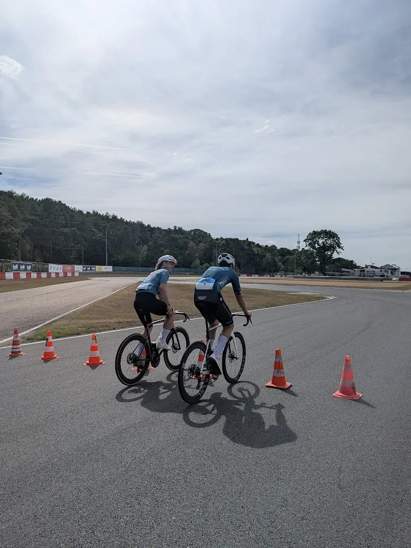
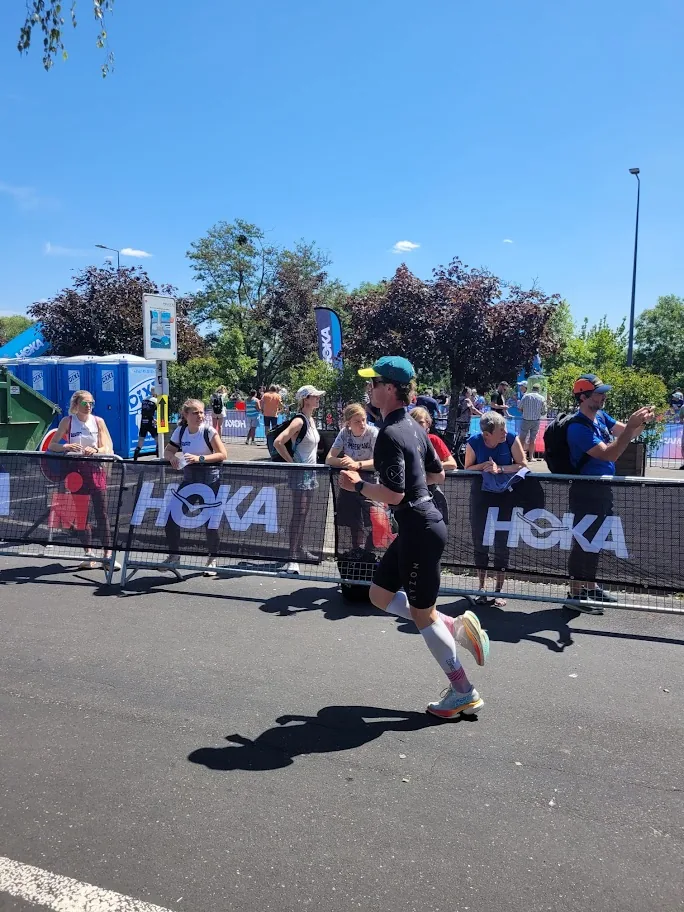
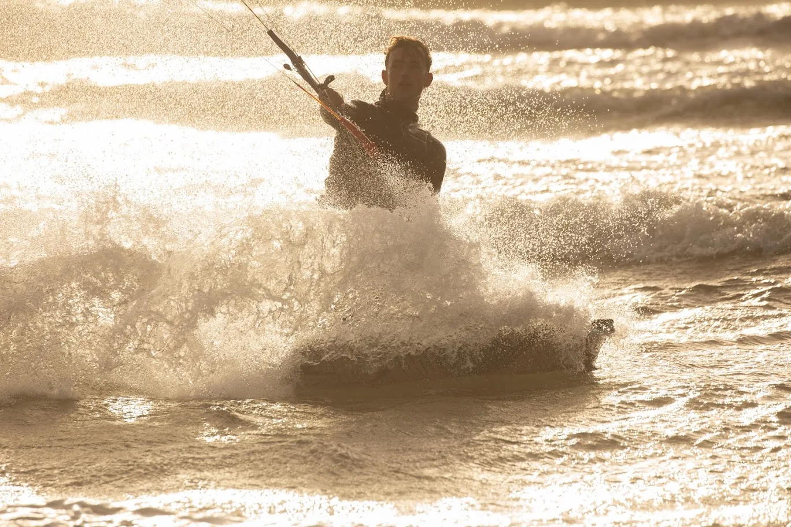
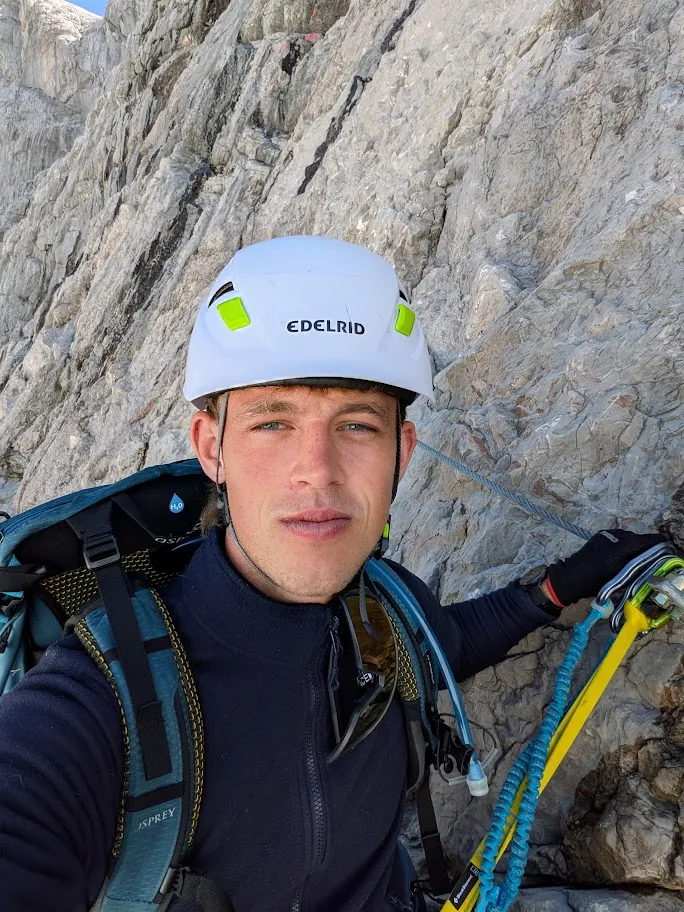
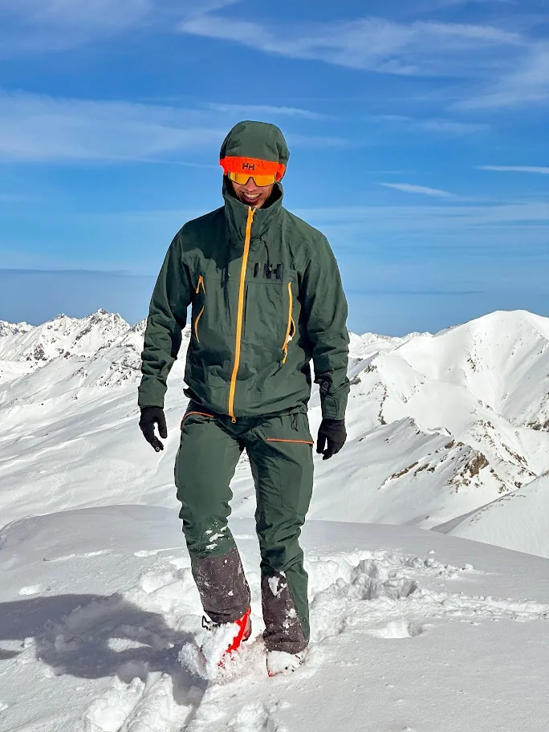

I am passionate about running, cycling, triathlon, and recently also HYROX. Endurance sport is a great balance to my academic work, and lessons from one often carry over into the other.

I also really enjoy mountain and water sports. I am a certified trainer in multiple sports, because I love sharing my passion for sport with others.

Outside of work and sports, I enjoy making pizza in my pizza oven, preparing good espresso, and spending time with friends.

## Gallery

  <figure>
    
  </figure>
  <figure>
    
  </figure>
  <figure>
    
  </figure>
  <figure>
    
  </figure>
  <figure>
    
  </figure>

