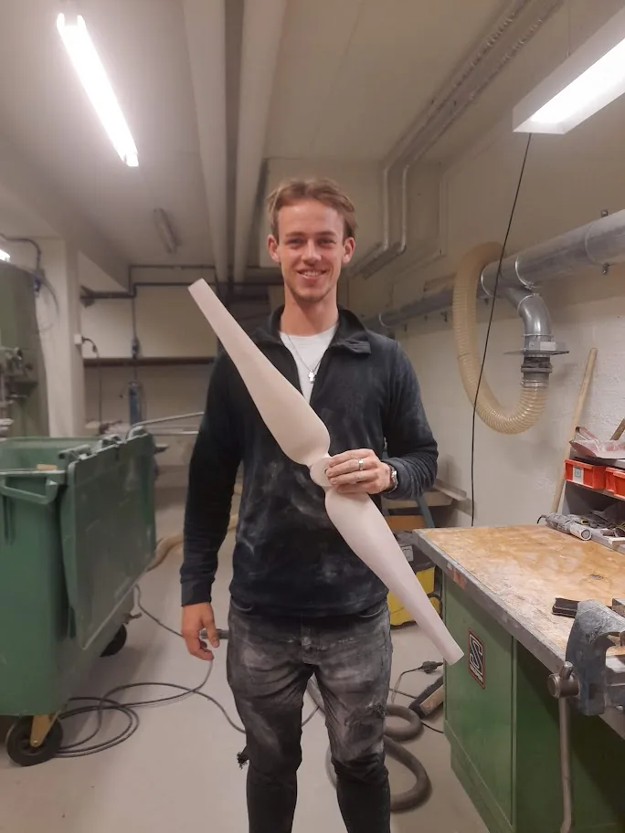

My research is concerned with machine learning, prediction, control, and the intersections of these fields. My methodological focus is on data-driven and predictive control approaches for technical energy systems.

## Research Interests

- Model predictive control
- Data-enabled predictive control
- Reinforcement learning controllers
- Data-driven modeling and prediction
- Distributed control of energy systems

## Methodological Directions

One direction I am currently highly interested in is prediction and control based on time series foundation models. I would like to understand how these models can be used not only for forecasting, but also as useful components in predictive control, and anomaly detection.

Another core interest is making complex nonlinear controllers available on inexpensive and resource-constrained hardware. Neural controllers and approximate MPC are promising tools for distilling computationally demanding controllers into fast policies.

I am also interested in the overlap between MPC, model predictive path integral control, model-based reinforcement learning, and model-free reinforcement learning. These fields often address similar problems with different assumptions and computational trade-offs.

For distributed energy systems, I would like to investigate primal-dual schemes for efficient prosumer markets in low-temperature district heating networks. More broadly, I am interested in agentic distributed control: making complex control systems configurable from smaller interacting subunits, so that larger systems can be designed, adapted, and operated in a modular way.

## Application Areas

::: {.application-interests}
::: {.application-copy}
My application interests are energy-related. I am especially interested in:

- Energy grids, especially low-temperature district heating networks
- Heating, cooling, and power generation systems
- Heat pumps, refrigeration cycles, and related supply machinery
- Energy hubs and coupled heat and power supply systems
- Industrial waste heat integration
:::

{alt="Ben Spoek holding a manufactured component in a workshop"}
:::

## Projects

::: {.research-entry}
### PAALi

**Process-optimized extraction of waste heat from the food industry into innovative 4th and 5th generation heating networks in two districts of the municipalities of Zapfendorf and Hagenow**

I am involved in the PAALi project, a publicly funded joint project that investigates how waste heat from the food industry can be integrated into the heat supply of rural districts. The project focuses on previously unused low-temperature waste heat at the BMi plant in Zapfendorf and the Kühne site in Hagenow, with the goal of supporting a regional heat transition.

A central part of PAALi is the development of an intelligent transfer station for heat extraction. Model-based methods and simulation studies are used to represent thermal processes, develop control strategies, and evaluate operating and expansion scenarios for low-temperature heating networks. Pilot plants at both industrial sites provide operational data that connect the modeling and optimization work with practical implementation.

More details are available on the [PAALi project page](https://www.ebc.eonerc.rwth-aachen.de/cms/e-on-erc-ebc/forschung/forschungsprojekte2/projekte-urbane-energiesysteme/~brpehe/paali/?lidx=1).
:::

## Publications

I will keep my publication list active here.

::: {.publication-entry}
### Distributed Nonlinear Model Predictive Control for Building Energy Systems: An ALADIN Implementation Study

  
<strong>Authors:</strong> Steffen Eser, Ben Spoek, Augustinus Schütz, Phillip Stoffel, Dirk Müller

  
<strong>Journal:</strong> Energy and AI, Volume 21, 2025, Article 100536

  
<strong>Link:</strong> <a href="https://www.sciencedirect.com/science/article/pii/S2666546825000680">ScienceDirect</a>

Abstract

The implementation of sophisticated control strategies for building energy systems is crucial for improving energy efficiency and occupant comfort. While nonlinear model predictive control offers promising benefits, its application to large-scale building systems remains challenging due to computational complexity and system coupling. This work presents a comprehensive study of nonlinear distributed model predictive control implementation for building energy systems, comparing Alternating Direction Method of Multipliers and Augmented Lagrangian Alternating Direction Inexact Newton algorithms alongside different modeling approaches.

We examine a multi-zone heating system with thermal storage and multiple producers, investigating both ordinary differential equation based and artificial neural network based modeling strategies. Through systematic parameter tuning using Bayesian optimization and closed-loop scaling analysis with up to 40 thermal zones, we demonstrate that ALADIN-based nonlinear distributed model predictive control can achieve performance comparable to centralized model predictive control, showing greater robustness to parameter variations than ADMM.

Our results reveal that artificial neural network based models effectively mitigate distributed integration errors and significantly reduce computation time compared to ordinary differential equation based approaches. Detailed computational profiling identifies specific bottlenecks in different nonlinear distributed model predictive control components. These findings advance the practical implementation of nonlinear distributed model predictive control in building energy systems, offering concrete strategies for modeling choices, parameter tuning, and system architecture design.

:::

## Own Theses and Project Work

::: {.publication-entry}
### Master's Thesis: An ALADIN-Based Approach for Data-Driven Distributed Model Predictive Control

  
<strong>Supervisor:</strong> Steffen Esser

Summary

Improving building energy systems control offers a key to reducing greenhouse gas emissions while balancing energy efficiency and comfort. Model predictive control is a promising approach, particularly for managing complex building energy systems holistically. However, this entails challenging non-convex optimization problems with high computational requirements that scale with system size. Distributed MPC can mitigate this through parallel subproblem solving, but requires efficient algorithms. The Alternating Direction Method of Multipliers shows limited success due to sublinear convergence in non-convex scenarios, whereas the Augmented Lagrangian Alternating Direction Inexact Newton algorithm promises faster convergence but faces practical challenges in application and parameterization.

This thesis adopts two strategies to address these challenges: a data-driven approach using artificial neural networks for rapid, comprehensive system analysis, and an automated parameterization technique to improve performance. Tests on a building energy system show that the proposed MPC reduces operating costs by 15.7% compared with ADMM and outperforms the centralized solver IPOPT in computational efficiency for larger systems, without compromising control quality. Artificial neural network models further reduce computation times significantly, demonstrating the potential of ALADIN-based MPC for efficient and stable building energy systems control while maintaining comfort standards.

:::

::: {.publication-entry}
### Bachelor's Thesis: Development and Evaluation of Machine Learning Methods for Dynamic Defrost Control of Air-to-Water Heat Pumps Regarding Adaptability and Transferability

  
<strong>Supervisor:</strong> Dr. Jonas Klingebiel

Summary

During the operation of air-to-water heat pumps, frost can form on the evaporator fins depending on ambient conditions, reducing heat transfer and lowering efficiency. The evaporator must therefore be defrosted regularly, but the energy used for defrosting is a loss that should be minimized. Commercial defrost controllers often initiate defrosting cyclically at fixed time intervals, even though frost growth depends strongly on ambient conditions and the heat pump's operating mode. As a result, defrosting is often initiated at a suboptimal time.

In this thesis, machine learning methods are used to develop self-learning defrosting controllers that approximate the optimal time for defrost initiation and thereby increase efficiency. The work investigates the ability of these controllers to adapt to disturbances such as foliage on the evaporator housing and technical changes to the heat pump, such as modified evaporator geometries. Two reinforcement learning agents, PPO and DQN, are implemented with hyperparameter optimization and compared. The results show that self-learning controls improve efficiency compared with time-based methods and that the reinforcement learning agents are capable of generalization, following reasonable defrosting strategies even under changing conditions.

:::

::: {.publication-entry}
### Project Work: Integration of Power-to-Gas Technologies in the Multi-Objective Operational Optimization of Energy Systems

  
<strong>Supervisor:</strong> Yifan Wang

Summary

To reduce CO2 emissions and reach climate targets, many nations are turning to electricity generation from renewable sources. Since solar radiation and wind cannot be controlled but should be used as much as possible, power peaks in the electricity grid can occur. The increasing share of renewable energies such as wind and solar power therefore calls for flexible balancing of the electricity grid. In addition, sectors such as aviation require indirect electrification.

Power-to-gas is a promising future technology for both challenges. The start-up times of power-to-gas plants are very short, making them suitable for grid balancing, and the generated fuel gases can be used as climate-neutral fuels if the required electricity comes from renewable sources. In this project work, the components electrolyzer, direct air capture carbon separator, and methanizer were modeled and incorporated into the simulation model of a power system with a dynamic load profile and variable electricity prices.

The suitability of power-to-gas plants for grid balancing was demonstrated. The work also showed that downtime of power-to-gas plants decreases significantly with an increasing share of renewable energies in the power grid, suggesting that prices for fuel gases generated in this way may decline in the future as renewable shares continue to rise.

:::
